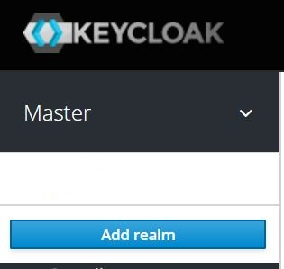

# Keycloak as Authorization Server
This project utilizes [Keycloak](https://www.keycloak.org/) as it is an [OpenID certified](https://openid.net/developers/certified/) identity provider.

If you have a Docker runtime installed, you can use following command to quickly start a Keycloak server:

```
docker run -d -e KEYCLOAK_USER=<ADMIN USERNAME> -e KEYCLOAK_PASSWORD=<ADMIN PASSWORD> jboss/keycloak
```
or choose another relevant [method](https://www.keycloak.org/docs/latest/server_installation/index.html#installation) for you.

## Create a new Realm

After starting Keycloak server you can launch to `<server.host>/auth/admin` and login to administration portal using admin username & password. Then you need to create a realm rather than top level "master" realm to manage users, credentials, roles, and groups.

Create a new realm by clicking on the drop-down arrow next to the realm name in the upper left corner.


