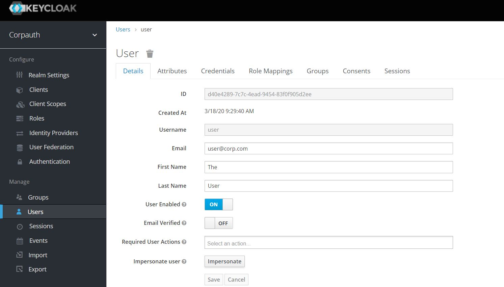
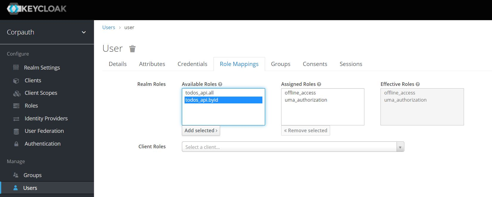
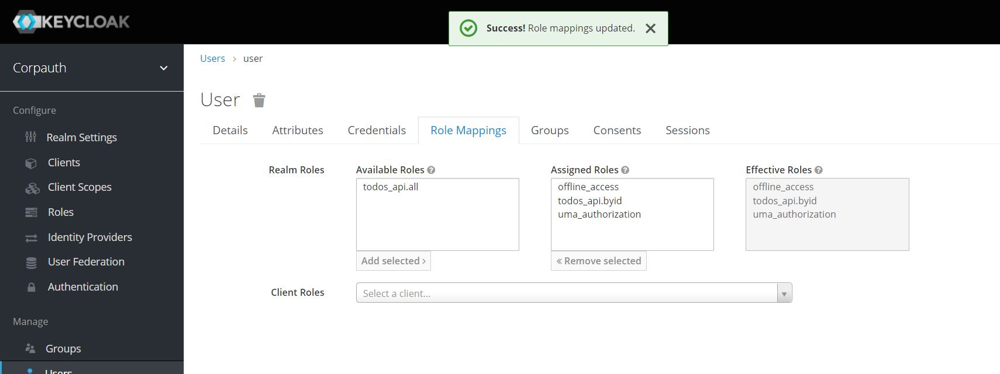

# Keycloak as Authorization Server
This project utilizes [Keycloak](https://www.keycloak.org/) as it is an [OpenID certified](https://openid.net/developers/certified/) identity provider.

If you have a Docker runtime installed, you can use following command to quickly start a Keycloak server with admin portal run on <span>h</span>ttp://localhost:8080/auth/admin:

```
docker run -d -p 8080:8080 -e KEYCLOAK_USER=<ADMIN USERNAME> -e KEYCLOAK_PASSWORD=<ADMIN PASSWORD> jboss/keycloak
```
or choose another relevant [method](https://www.keycloak.org/docs/latest/server_installation/index.html#installation) for you.

## Creating a new Realm

After starting Keycloak server you can launch to `<server.host>/auth/admin` and login to administration portal using admin username & password. Then you need to create a realm rather than top level "master" realm to manage users, credentials, roles, and groups.

To create a new realm use the drop-down menu next to the realm name in the upper-left corner:


For this project corpauth is the custom realm:


## Creating a client for SPA

To interact with IdP a client must be configured in Keycloak using `Clients` menu in left hand side then creating a client with Client Protocol set as openid-connect:


After saving, we can see all the configuration options of the client:
* `Valid Redirect URIs` should contain the address of SPA client.
* Make sure the Standard Flow is enabled and other flows are disabled to enable Authorization Code Flow. 
* `Access Type` should be `public` as SPAs are public clients.
* `Web Origins` should contain SPA root and resource server API endpoint root.


## Creating scope and roles

Roles and scopes are used to classify and control access to resources. Roles and scopes can be used by resource server to decide whether request to access a resource (API call) is authorized. For this project we only use realm level roles not scopes for authorization.

Use `Roles` menu in left hand side and click `Add Role` to add two roles:
* todos_api.all: Authorized to list all ToDo tasks
* todos_api.byid: Authorized to list ToDo tasks by ID


## Adding users

Use `Users` menu in left hand side and click `Add user` to add users:



* Enable `User Enabled`.
* After creation, set a password via Credentials tab. Disable `Temporary` setting to avoid password change prompt at first login.

## Assign Role

Assign relevant realm role to user defined at previous sections with selecting available role and clicking `Add selected`:

Before:


After:



